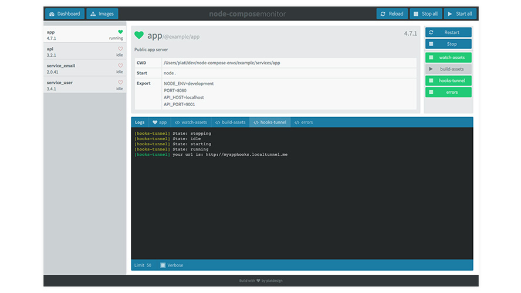

#node-compose

Start node-processes as with docker-compose and with a neat little ui.


[](https://travis-ci.org/platdesign/node-compose) 
[](http://packagequality.com/#?package=node-compose)
[](https://gitter.im/platdesign/node-compose?utm_source=badge&utm_medium=badge&utm_campaign=pr-badge)	

[](https://www.npmjs.com/package/node-compose)  
[Detailed npm trends and stats](http://npm-stat.com/charts.html?package=node-compose)

----




# Important

**`node-compose` is for development only! Don't use it in production!**


# Prerequisite

`node-compose` needs [nodemon](http://nodemon.io/) to be installed globally.

Install [nodemon](http://nodemon.io/): `npm install -g nodemon`

# Install

`npm install -g node-compose`


# Example

Create multiple servers. (eg for multiple microservices)

**`./process-a/index.js`** (Port 3000)

```javascript
const http = require('http');

const hostname = '127.0.0.1';
const port = 3000;

const server = http.createServer((req, res) => {
  res.statusCode = 200;
  res.setHeader('Content-Type', 'text/plain');
  res.end('Hello World\n');
});

server.listen(port, hostname, () => {
  console.log(`Server running at http://${hostname}:${port}/`);
});
```

**`./process-b/index.js`** (Port 4000)

```javascript
const http = require('http');

const hostname = '127.0.0.1';
const port = 4000;

const server = http.createServer((req, res) => {
  res.statusCode = 200;
  res.setHeader('Content-Type', 'text/plain');
  res.end('Hello World\n');
});

server.listen(port, hostname, () => {
  console.log(`Server running at http://${hostname}:${port}/`);
});
```

Create a compose-file. **`node-compose.yml`**

```yaml
process_a:
  build: ./process-a
  environment:
    - NODE_ENV=development

process_b:
  build: ./process-b
  environment:
    - NODE_ENV=development
```

Start node-compose shell with `node-compose`. Inside the shell start all processes with `start-all` or type `help` for more information about possible commands.

# Commands

```bash
Commands:
    help [command...]            Provides help for a given command.
    exit                         Closing shell and stop all images
    ps                           List running images
    reload                       Reloads config file and restarts processes if needed.
    start <image> [images...]    Start an image by <name> or all
    stop <image> [images...]     Stop an image by <name> or all
    restart <image> [images...]  Restart one or more images by given name or all
    images                       List all images found in config file.
    monitor [options]            Start web monitor
```


# Todo

- Use nodemon as a module to avoid global dep.
- Add more information about running processes to `ps`-view.


# Tests

Tests are written with [mocha](https://mochajs.org/).

1. Clone repo `git clone https://github.com/platdesign/node-compose.git`
2. Move to repo directory. `cd node-compose`
3. Install all dependencies. `npm install`
4. Run tests with `mocha`


# Author

Christian Blaschke <mail@platdesign.de>


### MIT License
Copyright (c) 2016 node-compose

Permission is hereby granted, free of charge, to any person obtaining a copy
of this software and associated documentation files (the "Software"), to deal
in the Software without restriction, including without limitation the rights
to use, copy, modify, merge, publish, distribute, sublicense, and/or sell
copies of the Software, and to permit persons to whom the Software is
furnished to do so, subject to the following conditions:

The above copyright notice and this permission notice shall be included in all
copies or substantial portions of the Software.

THE SOFTWARE IS PROVIDED "AS IS", WITHOUT WARRANTY OF ANY KIND, EXPRESS OR
IMPLIED, INCLUDING BUT NOT LIMITED TO THE WARRANTIES OF MERCHANTABILITY,
FITNESS FOR A PARTICULAR PURPOSE AND NONINFRINGEMENT. IN NO EVENT SHALL THE
AUTHORS OR COPYRIGHT HOLDERS BE LIABLE FOR ANY CLAIM, DAMAGES OR OTHER
LIABILITY, WHETHER IN AN ACTION OF CONTRACT, TORT OR OTHERWISE, ARISING FROM,
OUT OF OR IN CONNECTION WITH THE SOFTWARE OR THE USE OR OTHER DEALINGS IN THE
SOFTWARE.
